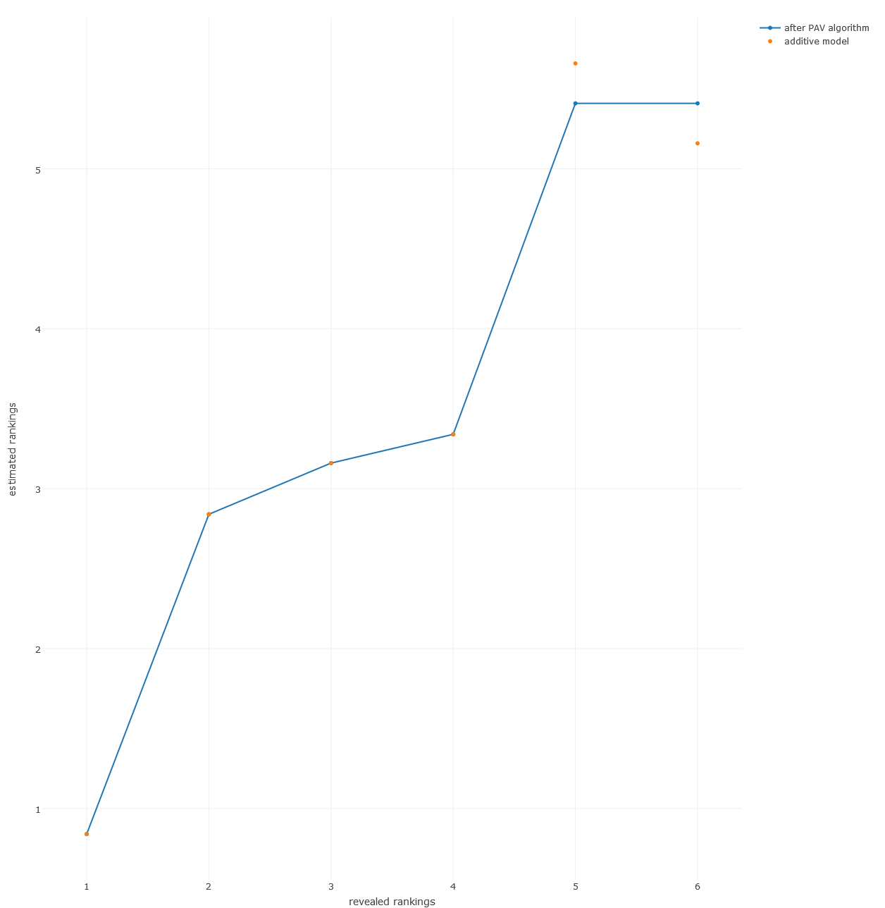

[](http://quantlet.de/index.php?p=info)

## [](http://quantlet.de/) **MVAcarrankings_plotly** [](http://quantlet.de/d3/ia)

##  [Interactive Plotly](http://quantlet.github.io/Plotly/MVAcarrankings_plotly.html)

```yaml

Name of QuantLet : MVAcarrankings_plotly

Published in : Applied Multivariate Statistical Analysis

Description : 'Performs a monotone transformation to the estimated stimulus utilities of the car
example by applying the pool-adjacent-violators (PAV) algorithm. Plotly technology is used (D3.js
and Java Script)'

Keywords : 'MDS, non-metric-MDS, multi-dimensional, scaling, PAV, violators, Shepard-Kruskal,
regression, plot, graphical representation'

See also : 'MVAMDScity1, MVAMDScity2, MVAMDSpooladj, MVAmdscarm, MVAnmdscar1, MVAnmdscar2,
MVAnmdscar3, MVAMDSnonmstart, PAVAlgo'

Author : Zografia Anastasiadou, Lukas Borke

Submitted : Thu, March 03 2016 by Lukas Borke

Input: 
- x: the reported preference orderings for the car example
- TRUE: the fitted values of x

Example : 'Plotly (D3.js and Java Script) Plot of estimated preference orderings vs revealed
rankings and PAV fit.'

```




```r

# clear all variables
rm(list = ls(all = TRUE))
graphics.off()

# install and load packages
libraries = c("isotone", "plotly")
lapply(libraries, function(x) if (!(x %in% installed.packages())) {
    install.packages(x)
})
lapply(libraries, library, quietly = TRUE, character.only = TRUE)

# the reported preference orderings
x = c(1:6)
# the estimated preference orderings according to the additive model (16.1) and the metric solution (Table 16.6) in MVA
y = c(0.84, 2.84, 3.16, 3.34, 5.66, 5.16)
z = cbind(x, y)

# PAV algorithm
gp = gpava(x, y)
a  = gp$z              # the reported preference orderings
b  = gp$x              # the estimated preference orderings after PAV algorithm
gp = cbind(a, b)

# Plotly plot of car rankings
gpdf = as.data.frame(gp)

p <- plot_ly(gpdf, x = a, y = b, type="l", name = "after PAV algorithm", text = paste("car", a, sep = ""), color = b) %>%
	layout(xaxis = list(title = "revealed rankings"), yaxis = list(title = "estimated rankings"))
p <- add_trace(p,y=y, mode = "markers", name = "additive model")
p

```
